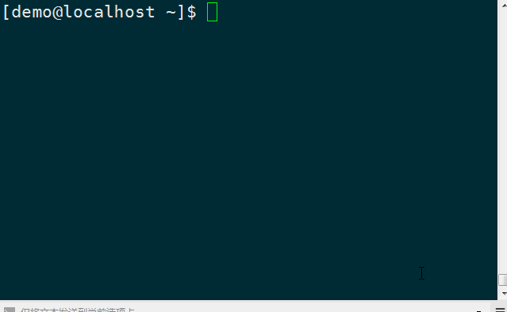

#河马 webshell扫描器 for docker 使用手册

[首页](http://www.shellpub.com)                 
[在线查杀](http://n.shellpub.com)

本教程适用于linux docker服务器环境的安装使用;[windows版本教程查看这里](http://www.webshell.pub/doc/hm_win_usage.html)
[linux版本教程查看这里](http://www.webshell.pub/doc/hm_linux_usage.html)

## 初衷

linux

## 安装使用

1. 安装docker

   	在使用hmdocker之前，您必须确保您的系统已经安装了docker, 推荐安装较新版本的docker环境。docker安装详细过程请阅读官方教程 <https://docs.docker.com/install/>
	
2. 下载hmdocker

		# 下载程序
		wget https://dl.shellpub.com/xxxx/hmdocker.sh
		# 添加到运行环境
		mv hmdocker.sh /usr/bin/hmdocker
		# 授予可执行权限
		chmod +x /usr/bin/hmdocker
	
3. 拉取仓库中的hmdocker镜像

		# hmdocker在执行时会自动检测镜像是否存在，如果不存在会自动拉去
		# 首次使用建议手动拉取
		docker pull shellpub/hm

4. 使用

	

	hmdocker 参数和用法和hm基本一样
	
	4.1 查看帮助
		
		hmdocker -h

	4.2 查看版本

		hmdocker version

	4.3 扫描后门

		hmdocker scan 你的web目录

		扫描完成之后结果会保存为result.csv文件，使用记事本或者excel打开查看

	4.4 升级

		hmdocker update	

5. FAQ

	5.1 无法连接到云服务

		本产品采用本地+云端双引擎，需要联网之后才能准确查杀；请检查您的网络是否能访问云服务，可以在命令行中执行curl https://api.shellpub.com/v2/version, 如果返回正常结果说明您的系统时间未同步，请先同步系统时间；如果返回报错，可能是您系统PKI证书老旧，请升级ca

## Tips

## 联系我们

如果您在使用过程中遇到了困难，或者有好的建议反馈给我们。可以通过以下方式联系我们：
	
   QQ:1494922137  
   <service@shellpub.com>